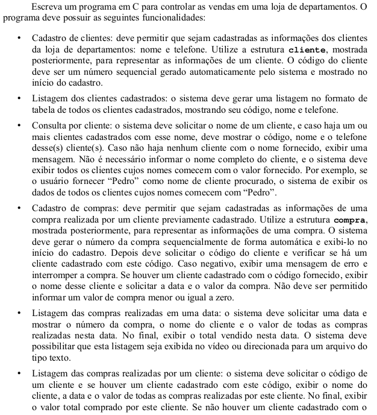

<!--Weblog desenvolvido por
Gustavo S. Bacagine e Lucas Pereira de Matos 
Git Hub: https://github.com/Bacagine/LP-Trab02-2019-2 -->

# **Lojinha do Berg**

Aplicação criada como 2º Trabalho do 2º Semestre do curso de 
Análise e Desenvol-

vimento de Sistemas (ADS)
da FATEC para aula de Programação do professor

Ciro Cirne Trindade [(site do Professor Ciro)](https://sites.google.com/site/ciroct/home)

## **Desenvolvedores**

Gustavo Bacagine <gustavobacagine@protonmail.com>

Lucas Pereira de Matos <lucas.pereira.matos.000@gmail.com>

## **Escopo**

